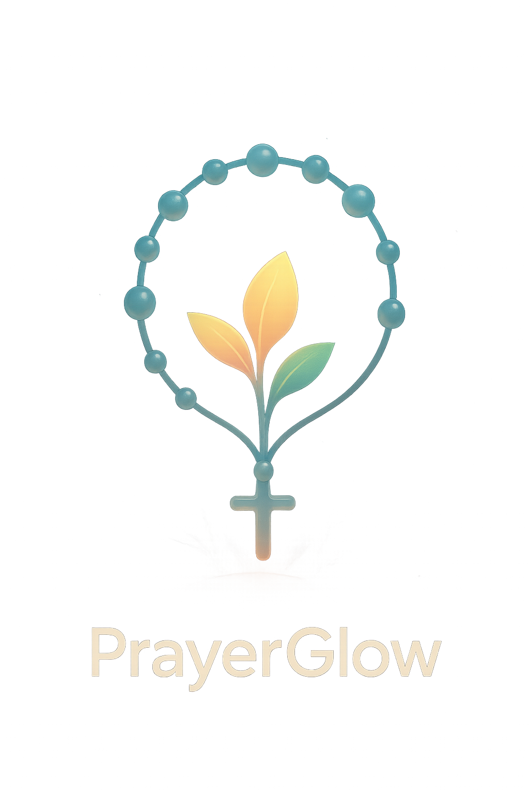

# PrayerGlow

  
  
Elevating the prayer experience through immersive, tactile spiritual technology

## Overview

**PrayerGlow** is a premium mobile application that elevates the prayer experience through innovative, spiritually enriching features. With an interactive 3D Rosary and a visually dynamic Prayer Garden, PrayerGlow combines cutting-edge technology with a deep sense of purpose.

PrayerGlow is being developed as a professional iOS application for the Apple App Store, with Android support planned as well. The application adheres to App Store guidelines and employs industry best practices for performance, security, and user experience.

## Core Spiritual Features

### 3D Interactive Rosary

- Physics-driven beads that respond naturally to touch and movement
- Tactile prayer experience enhanced by haptic feedback
- Visual and audio guidance through the Rosary prayer sequence

### Prayer Garden

- Visual representation of your spiritual growth journey
- Garden elements (paths, flowers, trees) reflect prayer activity
- Personalized sacred space that evolves with your prayer life

### Examination of Conscience

- Structured reflection on daily spiritual life
- Guided examination process with thoughtful prompts
- Integration with the Prayer Garden visualization

### Dialogical Prayer

- Guided conversation-style prayer experience
- Scripture-based reflections and prompts
- Deepens personal connection through structured dialogue

## Technology in Service of Spirituality

PrayerGlow uses technology to enhance, not replace, traditional prayer practices:

### Mobile Application

- React Native for cross-platform experience (iOS & Android)
- Thoughtful UI designed for contemplative experiences
- Offline support for prayer anytime, anywhere

### 3D Visualization

- Three.js rendering for immersive prayer environments
- GPU-optimized physics for realistic interactions
- Carefully optimized for all device capabilities

### Backend Services

- Secure user authentication and data protection
- Efficient prayer content delivery
- Optional cloud synchronization of prayer journey

## Sample Architecture

This repository includes architectural patterns and simplified code examples that demonstrate how technology serves the spiritual experience:

- Rendering techniques for the 3D Rosary and Prayer Garden
- Performance optimization for smooth interactions
- Thoughtful organization of prayer content

**Note**: This repository contains simplified examples that showcase the architectural approach and spiritual focus of PrayerGlow.

## Responsible Design Principles

PrayerGlow follows these core principles:

- **Technology serves spirituality**, not the other way around
- **Core prayer content remains accessible** to all users
- **Premium features enhance** rather than restrict the prayer experience
- **Performance and accessibility** across a wide range of devices
- **Privacy by design** in all aspects of the application

## Development Status

PrayerGlow is currently in active development, with a planned release on the Apple App Store. The application is being built with a focus on:

- Professional-grade performance optimization for smooth 3D interactions
- Cross-platform compatibility using React Native
- Compliance with App Store guidelines and requirements
- Rigorous testing across different iOS devices
- Thoughtful user experience design for spiritual activities

The development roadmap includes initial iOS release followed by Android support, with ongoing feature enhancements based on user feedback.

## License

Copyright © 2024 Alexis San Javier. All rights reserved.

## Contact

For inquiries about this project, please contact:

- LinkedIn: [Alexis San Javier](https://www.linkedin.com/in/alexissj/)
- GitHub: [@code-guy21](https://github.com/code-guy21)
